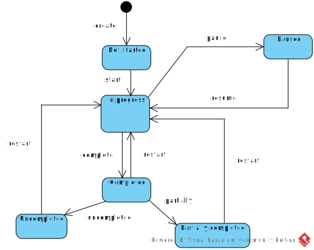

# OpenPlan

## Basic entities

*Entity Relationship Diagram*  

## State transition for task status

*State machine diagram*  

## Demo

[Click here to see demo](https://openplan-i4rimw5qwq-de.a.run.app)
